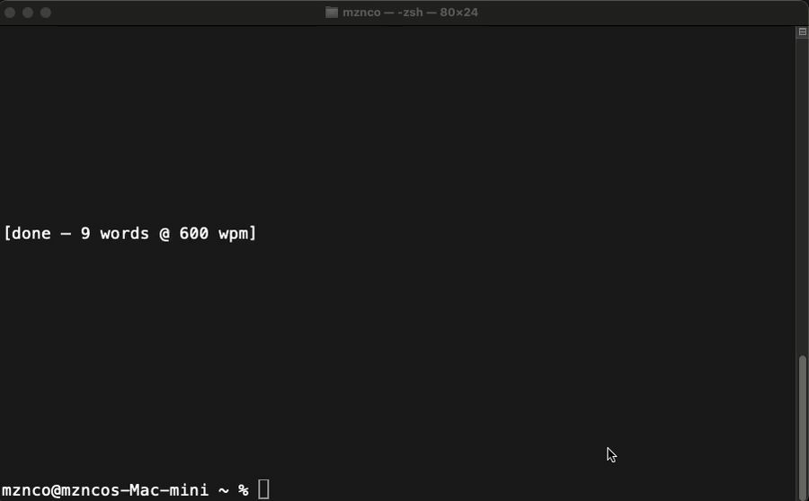

# rsvp-reader

A Claude Code plugin (and standalone CLI) that flashes text one word at a time in a terminal using **Rapid Serial Visual Presentation (RSVP)** — Spritz-style, with the **Optimal Recognition Point (ORP)** letter drawn in red at a fixed column. Read Claude's responses at 600+ WPM without leaving your shell.



## What it does

Claude produces a lot of words. RSVP lets you consume them faster by eliminating saccades: words flash at a fixed terminal position with the ORP letter anchored to a fixed column, so your eyes never have to move.

Two ways to use this:

- **`/flash` slash command** — inside Claude Code, pops a new Terminal.app window that flashes your previous Claude response at 600 WPM. macOS-only (depends on `osascript` + `Terminal.app`).
- **`rsvp` CLI** — outside Claude Code, a plain Python program you can run from any shell. Works on any POSIX-ish system with Python 3.

## Features

- **Spritz-style ORP highlighting** — the Optimal Recognition Point letter of each word is drawn in red and anchored to a fixed column, so your eyes stay still while your brain reads.
- **Vertically centered** — words flash at the middle row of the terminal window, not jammed against the top.
- **Path-aware tokenization** — long filesystem paths and URLs split at `/` boundaries so `/Users/you/some/long/path.txt` flashes as five readable segments (`/Users/`, `you/`, `some/`, `long/`, `path.txt`) instead of one unreadable blob. URL schemes (`https://…`) stay intact as a unit.
- **Tiered long-word timing** — words over 12 / 18 characters get proportionally more dwell time (1.3× / 1.6×). Punctuation gets extra pause too (periods 2.2×, commas 1.5×).
- **Interactive controls** — `Space` to pause, `q` or `Ctrl+C` to quit. Controls work even when stdin is piped from a file (the script auto-reopens `/dev/tty`).
- **Hidden cursor during playback, restored on exit** — no distracting blinking caret next to the flashing word. Restored cleanly even if you `Ctrl+C`.
- **Zero dependencies** — pure Python 3 standard library. No `pip install`, no virtualenv.

## Install

### As a Claude Code plugin

_Not yet published to a marketplace._ For now, clone this repo and point Claude Code at it as a local plugin source. See the [Claude Code plugin docs](https://docs.claude.com/en/docs/claude-code) for the install flow on your version.

### As a standalone `rsvp` CLI

One-time setup to get a short `rsvp` command on your PATH:

```bash
# Clone once
git clone https://github.com/dog-face/rsvp-reader ~/code/rsvp-reader

# Symlink into ~/.local/bin (most distros already have it on PATH;
# on macOS add this to ~/.zshrc if needed: export PATH="$HOME/.local/bin:$PATH")
mkdir -p ~/.local/bin
ln -sf ~/code/rsvp-reader/data/rsvp-term.py ~/.local/bin/rsvp
```

**Prefer an alias?** Same effect, no symlink:

```bash
echo 'alias rsvp="python3 $HOME/code/rsvp-reader/data/rsvp-term.py"' >> ~/.zshrc
```

## Usage

### `rsvp` CLI

From any shell:

```bash
rsvp "the quick brown fox jumps over the lazy dog"
echo "some text" | rsvp --wpm 800
pbpaste | rsvp
cat some-article.txt | rsvp --wpm 500
```

Flags:

| Flag | Default | Description |
|---|---|---|
| `--wpm N` | 600 | Words per minute |
| `--col N` | `cols / 2` | Column where the ORP letter is anchored |

Controls while the reader is running:

| Key | Action |
|---|---|
| `Space` | pause / resume |
| `q` or `Ctrl+C` | quit |

### `/flash` slash command (Claude Code only, macOS)

```
/flash                       # flashes your previous Claude response
/flash "some custom text"    # flashes whatever you pass
```

Pops a new Terminal.app window via `osascript` running the `rsvp-term.py` script against a scratch file at `/tmp/claude-flash.txt`.

### Trailing-marker convention

End any normal message with `/flash` as the last token to get "respond in chat **AND** flash the response in a new Terminal window":

```
hey claude, explain what a git rebase is /flash
```

Claude will reply in-chat as usual *and* pop a Terminal window flashing the reply. This is a behavioral convention Claude honors via a saved feedback memory, not a Claude Code slash-command parser feature. Ask Claude to set it up for you, or look at `commands/flash.md` in this repo and save an equivalent memory yourself.

## How it works

RSVP (Rapid Serial Visual Presentation) is a speed-reading technique where words are flashed sequentially at a single fixed location so the reader doesn't need saccades — the tiny eye movements that normally consume ~80% of reading time. By pinning every word's **Optimal Recognition Point** (the letter your brain anchors on to recognize the word, located roughly 1/3 of the way in depending on length) to a fixed screen column, your eye never has to move at all.

Schematic (red letter = ORP, anchored at the same column for every word):

```
the     ← 'h' in red
quick   ← 'u' in red
brown   ← 'r' in red
fox     ← 'o' in red
```

## Research notes

Reading speed gains with RSVP are real — peer-reviewed studies show 600–900 WPM is achievable — but there are comprehension tradeoffs: you lose the ability to regress (re-read a phrase to pick up context), and visual fatigue increases at sustained high rates. RSVP works best for narrative prose; it's worse for dense technical text where regressions actually help comprehension. See [The Conversation: Spritz and other speed reading apps — prose and cons](https://theconversation.com/spritz-and-other-speed-reading-apps-prose-and-cons-24467).

## Requirements

- **Python 3** (standard library only — no `pip` needed)
- **macOS** for the `/flash` slash command only (requires `osascript` + `Terminal.app`). The `rsvp` CLI itself works on any POSIX-ish system with a terminal and Python 3.

## Credits

Inspired by [SeanZoR/claude-speed-reader](https://github.com/SeanZoR/claude-speed-reader), a browser-based Claude Code RSVP reader that introduced me to the idea of speed-reading AI responses. This project takes the concept in a different direction — terminal-native instead of browser-based, with its own tokenization and timing heuristics.

## License

MIT. See [LICENSE](LICENSE).
